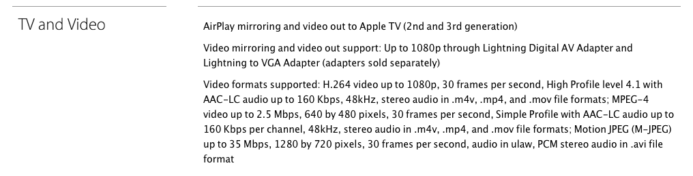

# Http Live Streaming Tutorial

This tutorial will guide you through the process of taking a video file and creating an Http Live Streaming presentation for use on your website, App.
All resources hosted on this site are copyright free, so please feel free to copy an distribute them as you like.

This tutorial is targeted for Mac OSX. If you are using a different platform, the instruction may be slightly different.

# Setup

Before we get started, we will need to do some setup.

## Installing Tools

First we will need to install software to do our video encoding. Most of you may already be familiar with handbrake. But for this tutorial, we will need
more control over the video encode process, so we will be installing [FFmpeg](http://www.ffmpeg.org). The ffmpeg recipe is available for Homebrew so the
installation process is easy although there can be a number of packages so this may take a while. Go get some coffee (or Scotch)!

```bash
$ brew install ffmpeg
```


Now that we have ffmpeg installed, we will need the tools from Apple [Http Live Streaming](https://developer.apple.com/streaming/) website under Downloads.
You will be required to sign in using your Apple Developer Account, so have your login ready.

This we be a DMG file with an automated installer, so hopefully that's pretty to install.

## Download Source Video

Download the 1080p version of [Big Buck Bunny](http://mirrorblender.top-ix.org/peach/bigbuckbunny_movies/big_buck_bunny_1080p_h264.mov).
We will be using this as our example source video for the rest of the tutorial.

# Steps

## Find the stream indices

The first step is to find the stream indices in the source video. This is pretty easy to find if you know where to look.
FFMpeg comes with a tool called *ffprobe* which you can use to query information about the source video file.
In this case, we what to find out the stream indices of the main video and audio.

```bash
$ ffprobe -show_streams -print_format compact -i big_buck_bunny_1080p_h264.mov | awk 'BEGIN { FS = "|" }; { print $2, $3 }'
```

```bash
Input #0, mov,mp4,m4a,3gp,3g2,mj2, from 'big_buck_bunny_1080p_h264.mov':
  Metadata:
   major_brand     : qt
   minor_version   : 537199360
   compatible_brands: qt
   creation_time   : 2008-05-27 18:40:35
    timecode        : 00:00:00:00
  Duration: 00:09:56.46, start: 0.000000, bitrate: 9725 kb/s
    Stream #0:0(eng): Video: h264 (Main) (avc1 / 0x31637661), yuv420p, 1920x1080, 9282 kb/s, 24 fps, 24 tbr, 2400 tbn, 4800 tbc   <-- Video
    Metadata:
      creation_time   : 2008-05-27 18:40:35
      handler_name    : Apple Alias Data Handler
    Stream #0:1(eng): Data: none (tmcd / 0x64636D74)
    Metadata:
      creation_time   : 2008-05-27 18:40:35
      handler_name    : Apple Alias Data Handler
      timecode        : 00:00:00:00
    Stream #0:2(eng): Audio: aac (mp4a / 0x6134706D), 48000 Hz, 5.1, fltp, 437 kb/s    <-- Audio
    Metadata:
      creation_time   : 2008-05-27 18:40:35
      handler_name    : Apple Alias Data Handler
```

Here are the lines we are interested in
 * Stream #0:0(eng): Video: h264 (Main) (avc1 / 0x31637661), yuv420p, 1920x1080, 9282 kb/s, 24 fps, 24 tbr, 2400 tbn, 4800 tbc
 * Stream #0:2(eng): Audio: aac (mp4a / 0x6134706D), 48000 Hz, 5.1, fltp, 437 kb/s

## Seperating the Video and Audio

Now that we know where the video and audio stream are located, lets seperate them out in to individual resources.

```bash
$ ffmpeg -i big_buck_bunny_1080p_h264.mov -map 0:2 -c:a:0 copy big_buck_bunny_1080p_h264.aac
$ ffmpeg -i big_buck_bunny_1080p_h264.mov -bsf h264_mp4toannexb -map 0:0 -c:v:0 copy big_buck_bunny_1080p_h264.ts
```

## Encode the Video

Now we need to re-encode the video stream that we seperated out in to streams with different quality levels and bitrates.
Note! Be sure to check the supported video and audio codecs that your targeted devices support to make sure that what you are encoding will actually play back.

For our demo, we are going to target (iPhone 5)[http://www.apple.com/iphone/specs.html], so we need to view the *TV and Video* section of the iPhone 5 spec website
and look for the h264 video codec properties and the supported AAC audio codec properties.



In this case, it supports:

 * H264 -High Profile, Level 4.1
 * AAC-LC

If we look at the (ffmpeg x264 Encoding Guide)[http://ffmpeg.org/trac/ffmpeg/wiki/x264EncodingGuide], we can see that ther are x264 encode settings that match up
with settings listed above. Here are the settings that should probably be familiar with.

 * Presets

  - ultrafast
  - superfast
  - veryfast
  - faster
  - fast
  - medium
  - slow
  - slower
  - veryslow
  - placebo

 * Profiles

  - baseline
  - main
  - high
  - high10
  - high422
  - high444

Next, we are going to encode our video.

__For these examples, I'm changing the encode preset, just as an example. Please choose the preset that is right for you. Slower presents tend to have better quality.__

```bash
$ ffmpeg -i big_buck_bunny_1080p_h264.ts -b 2500k -map 0:v -c:v libx264 -preset veryslow -profile:v high -level 4.1 -s 1920x1080 big_buck_bunny_1080p_h264_b2500k.ts
$ ffmpeg -i big_buck_bunny_1080p_h264.ts -b 2000k -map 0:v -c:v libx264 -preset veryslow -profile:v high -level 4.1 -s 1280x720 big_buck_bunny_720p_h264_b2000k.ts
$ ffmpeg -i big_buck_bunny_1080p_h264.ts -b 1000k -map 0:v -c:v libx264 -preset medium -profile:v main -level 3.1 -s 1280x720 big_buck_bunny_720p_h264_b1000k.ts
$ ffmpeg -i big_buck_bunny_1080p_h264.ts -b 800k -map 0:v -c:v libx264 -preset medium -profile:v main -level 3.0 -s 1024x600 big_buck_bunny_1024x600p_h264_b800k.ts
$ ffmpeg -i big_buck_bunny_1080p_h264.ts -b 600k -map 0:v -c:v libx264 -preset fast -profile:v main -level 3.0 -s 1024x600 big_buck_bunny_1024x600p_h264_b600k.ts
```


## Add back the Audio

```bash
$ ffmpeg -i big_buck_bunny_720p_h264_b2000k.ts -i big_buck_bunny_1080p_h264.aac -c:v copy -c:a copy big_buck_bunny_720p_h264_b2000k_muxed.ts
$ ffmpeg -i big_buck_bunny_720p_h264_b1000k.ts -i big_buck_bunny_1080p_h264.aac -c:v copy -c:a copy big_buck_bunny_720p_h264_b1000k_muxed.ts
$ ffmpeg -i big_buck_bunny_1024x600p_h264_b800k.ts -i big_buck_bunny_1080p_h264.aac -c:v copy -c:a copy big_buck_bunny_1024x600p_h264_b800k_muxed.ts
$ ffmpeg -i big_buck_bunny_1024x600p_h264_b600k.ts -i big_buck_bunny_1080p_h264.aac -c:v copy -c:a copy big_buck_bunny_1024x600p_h264_b600k_muxed.ts
```

## Create the Streams using Apple Stream Segmenter

```bash
$ mediafilesegmenter -t 10 -i big_buck_bunny_1080p.m3u8 -z big_buck_bunny_1080p-iframe.m3u8 -I -f./1080p big_buck_bunny_1080p_h264_b2500k_muxed.ts
$ mediafilesegmenter -t 10 -i big_buck_bunny_720p_b2000.m3u8 -z big_buck_bunny_720p_b2000-iframe.m3u8 -I -f./720p_2000 big_buck_bunny_720p_h264_b2000k_muxed.ts
$ mediafilesegmenter -t 10 -i big_buck_bunny_720p_b1000.m3u8 -z big_buck_bunny_720p_b1000-iframe.m3u8 -I -f./720p_1000 big_buck_bunny_720p_h264_b1000k_muxed.ts
$ mediafilesegmenter -t 10 -i big_buck_bunny_WSVGA_b800.m3u8 -z big_buck_bunny_WSVGA_b800-iframe.m3u8 -I -f./WSVGA_800 big_buck_bunny_WSVGA_h264_b800k_muxed.ts
$ mediafilesegmenter -t 10 -i big_buck_bunny_WSVGA_b600.m3u8 -z big_buck_bunny_WSVGA_b600-iframe.m3u8 -I -f./WSVGA_600 big_buck_bunny_WSVGA_h264_b600k_muxed.ts
$ mediafilesegmenter -t 10 -i big_buck_bunny_WSVGA_b600_audio.m3u8 -a -I -f./WSVGA_600_audio big_buck_bunny_WSVGA_h264_b600k_muxed.ts
```

## Add streams to a Master Playlist

```bash
$ variantplaylistcreator -o big_buck_bunny.m3u8 \
    1080p/big_buck_bunny_1080p.m3u8 big_buck_bunny_1080p_h264_b2500k_muxed.plist -i 1080p/big_buck_bunny_1080p-iframe.m3u8 \
    720p_2000/big_buck_bunny_720p_b2000.m3u8 big_buck_bunny_720p_h264_b2000k_muxed.plist -i 720p_2000/big_buck_bunny_720p_b2000-iframe.m3u8 \
    720p_1000/big_buck_bunny_720p_b1000.m3u8 big_buck_bunny_720p_h264_b1000k_muxed.plist -i 720p_1000/big_buck_bunny_720p_b1000-iframe.m3u8 \
    WSVGA_800/big_buck_bunny_WSVGA_b800.m3u8 big_buck_bunny_WSVGA_h264_b800k_muxed.plist -i WSVGA_800/big_buck_bunny_WSVGA_b800-iframe.m3u8 \
    WSVGA_600/big_buck_bunny_WSVGA_b600.m3u8 big_buck_bunny_WSVGA_h264_b600k_muxed.plist -i WSVGA_600/big_buck_bunny_WSVGA_b600-iframe.m3u8 \
    WSVGA_600_audio/big_buck_bunny_WSVGA_b600_audio.m3u8 big_buck_bunny_WSVGA_h264_b600k_audio_muxed.plist
```

# Playing back HLS in an iOS App

## Add Frameworks

If you are going to us MPMoviePlayerViewController and MPMoviePlayer for playing back your stream, you will need to add

 * MediaPlayer.framework

to your XCode project.

## Code

To display the the movie player from code, you only need to add the following lines:

```objc
NSURL *movieURL = [NSURL URLWithString:@"http://example.com/somefile.m3u8"];
movieController = [[MPMoviePlayerViewController alloc] initWithContentURL:movieURL];
[self presentMoviePlayerViewControllerAnimated:movieController];
```

# References

## Credits

[Kevin Kirkup](https://github.com/kevinkirkup)([@pan_and_scan](http://twitter.com/pan_and_scan))

Many thanks to the [Big Buck Bunny Team](http://www.bigbuckbunny.org/index.php/the-team/) for creating awesome video used in this tutorial.

## License

MIT
